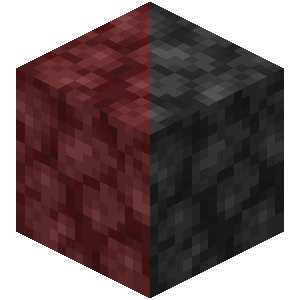

## Minecraft Dark Netherrack Resource Pack

Have you ever sored your eyes by endless mining for netherite in the nether?

Have you ever burned your retina by helplessly wandering for fortress in the nether?

Now here's a solution: Make the netherrack darker!

## How to use

1. Download the resource pack (`dark-netherrack.zip`) from release.

2. Open your `.minecraft` folder

3. Put `dark-netherrack.zip` in the `resourcepacks` folder.

4. Launch Minecraft

5. Options -> Resource Packs... -> Available

6. Select `dark-netherrack.zip`. If done correctly, it will move to selected.

7. Done! Enjoy your adventure without straining your eyes!

## Target minecraft versions

I think this pack is able to work on any version after the nether update (1.16).